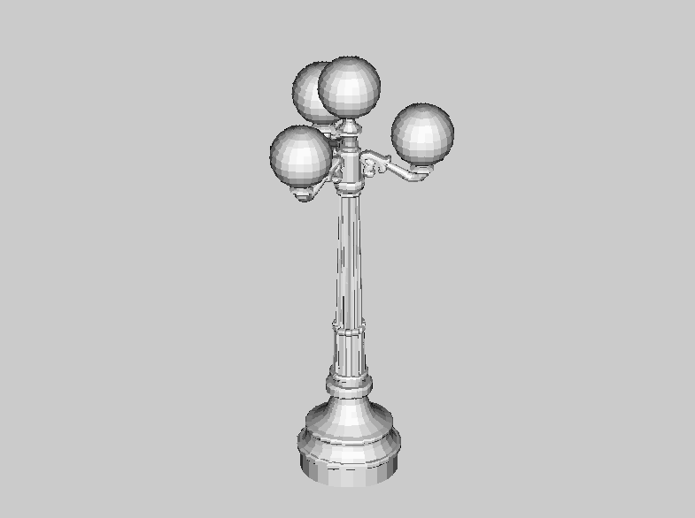
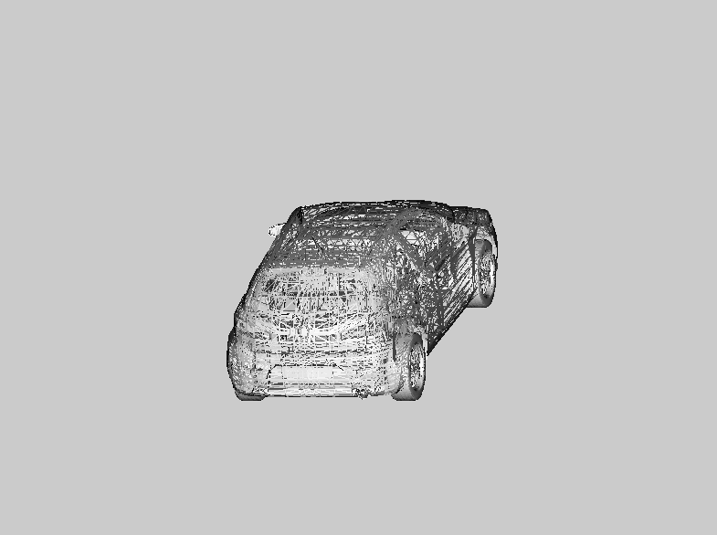

# Overview

This is a small pure software renderer to visualize arbitrary 3D models and theoretically, anything that can be reduced to vertices and triangles. It's primary purpose was to refresh my knowledge about computer graphics and to built something based on first principles. That means, that I didn't want to use any existing 3D engine but instead built everything via a single operation `pixel`:

```kotlin
interface Canvas {
    // Return width and height of the canvas.
    val width: Int
    val height: Int  
    
    // Draw a single pixel at (x,y) with color rgb.
    fun pixel(x: Int, y: Int, rgb: Int)
}
```
The underlying graphical system to implement this single method is [libGDX](https://libgdx.com/). 

The two most interesting classes are probably [Model.kt](https://github.com/mlesniak/libgdx-kotlin-gradle-engine/blob/main/src/main/kotlin/com/mlesniak/engine/engine/Model.kt) which contains the loader for [.obj](https://en.wikipedia.org/wiki/Wavefront_.obj_file) files and [Engine.kt](https://github.com/mlesniak/libgdx-kotlin-gradle-engine/blob/main/src/main/kotlin/com/mlesniak/engine/engine/Engine.kt) which contains the actual implementation of the rendering engine.

## Build and Run

Thanks to libGDX, a simple

    gradle build
    java -XstartOnFirstThread -jar build/libs/base-kotlin-gdx-gradle-all.jar

should suffice to build and run the project. The parameter `-XstartOnFirstThread` is necessary on MacOS and can be omitted on other operating systems.

## TODOs

As with every private project, it's neither finished nor professionally complete -- but that's the whole idea of recreational projects, right? Hence, these things are (at least) still open:

### Improve rendering speed

That's a tricky one. Right now the engine uses a single core and educational (instead of more performant) algorithms. We're also not using any GPU at all, which definitely limits possible performance gains. Nevertheless, it would be interesting to figure out how fast we can get by investing some time in benchmarks and bytecode analysis.

### Testing

As with every graphical project, testing is challenging. At least the underlying mathematical operations could be supported by accompanying tests.

### Perspective instead of Orthogonal Projection

Right now, the z-Coordinate is basically ignored and there is no correct perspective correction based on its value. In theory this can easily be implemented since there are just some additional matrix operations.

### Mouse-based Camera Movement

It would be nice to move around the scene with standard WASD keys and mouse movements; I've done it for another private project where I directly used OpenGL in Go (and thus it's a bit boring to implement it again).

### Fix rendering artifacts

There are still some rendering artifacts and not completely accurate rendering of small triangles; this is probably due to my choice of algorithms and my initial decision to use Floats instead of Doubles. In hindsight, using Floats probably wasn't worth it.

## Examples






