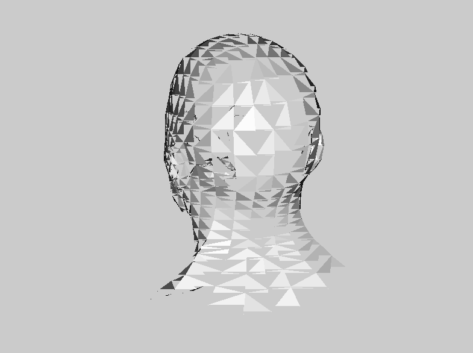

# Overview

Work in progress -- no information here yet ... and there's a lot of cleanup necessary, currently totally in hack mode.

Complete "From scratch software renderer", we just need a function to draw a single pixel (and, for performance reasons, something to clear the whole window). Everything else, e.g. projections, line drawing, etc. is done by the engine.

```kotlin
class Canvas(private val pixmap: Pixmap) {
    val width: Int = pixmap.width

    val height: Int = pixmap.height

    fun pixel(x: Int, y: Int, rgb: Int) {
        val rgba = rgb shl 8 or 0xFF
        pixmap.drawPixel(x, y, rgba)
    }

    // For performance reasons.
    fun clear(rgb: Int) {
        pixmap.setColor(rgb shl 8 or 0xFF)
        pixmap.fill()
    }
}
```

Bug: White Flickering on some triangles (precision problems?) 

